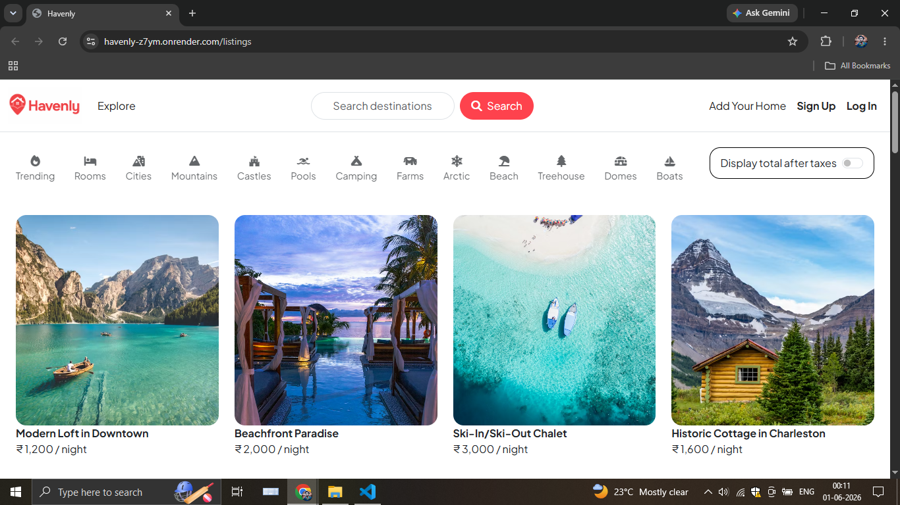
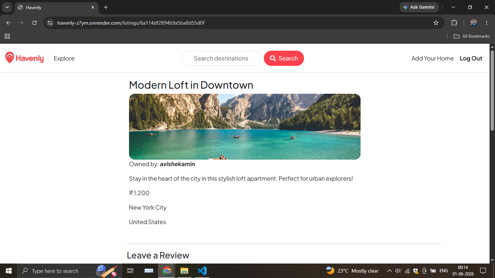
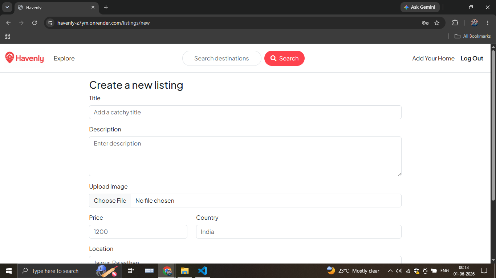
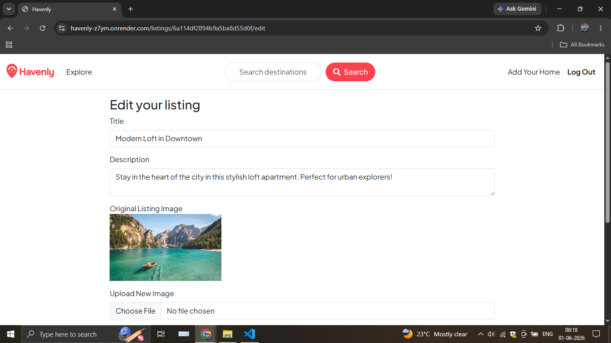
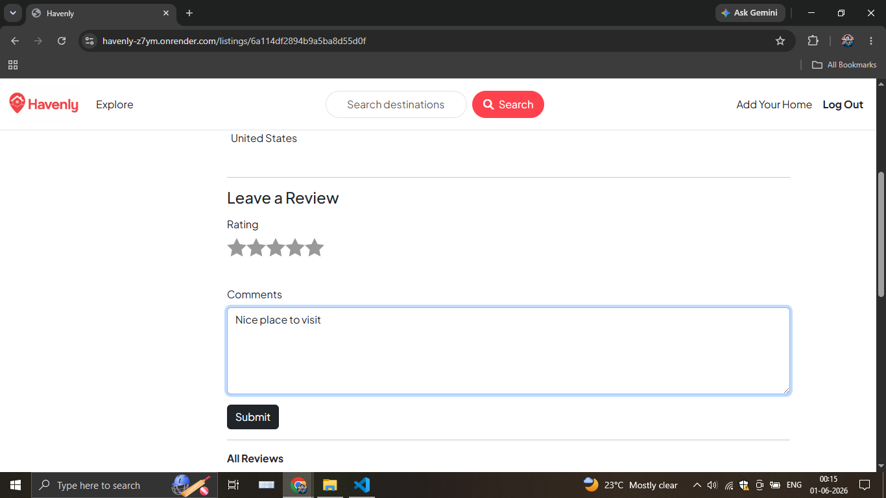
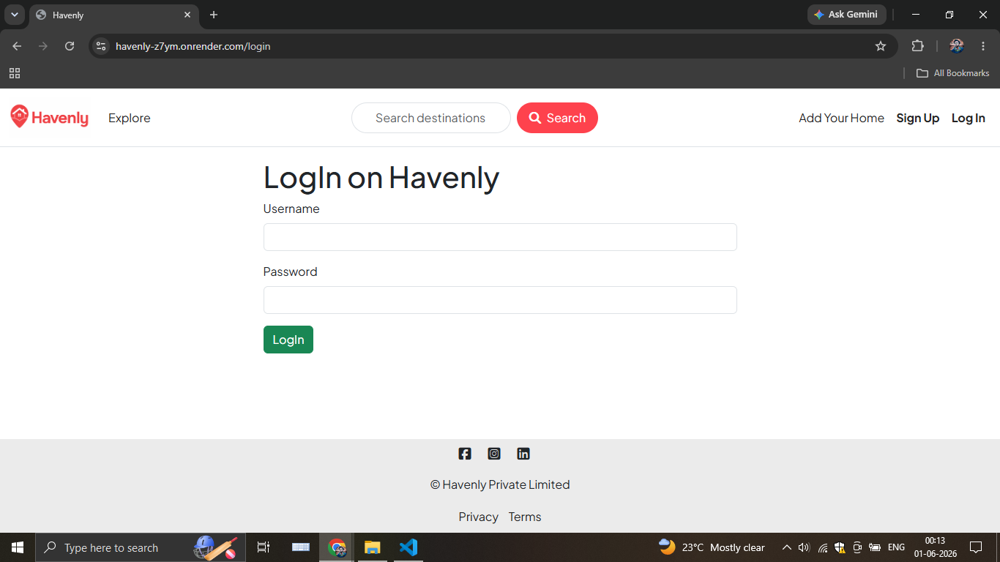
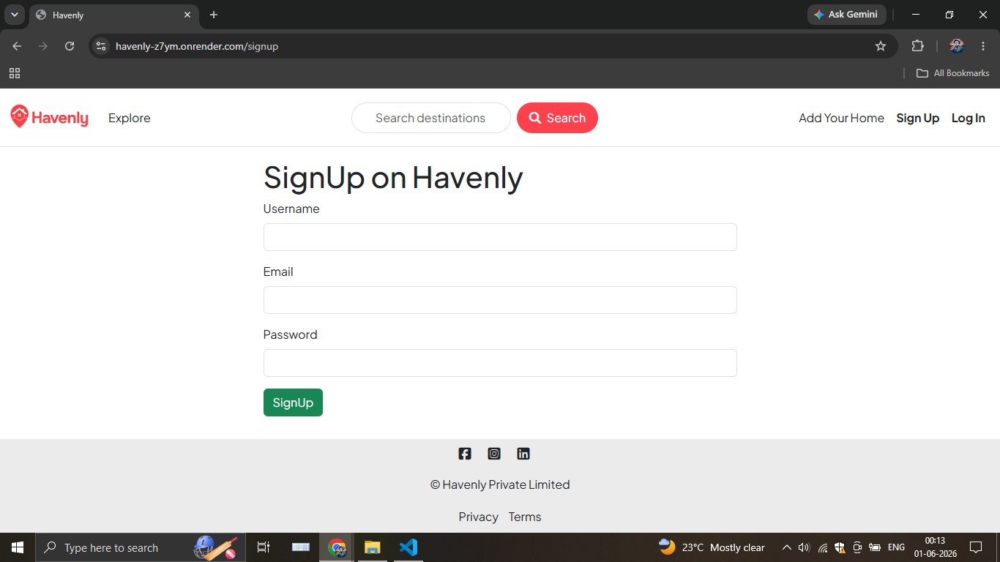
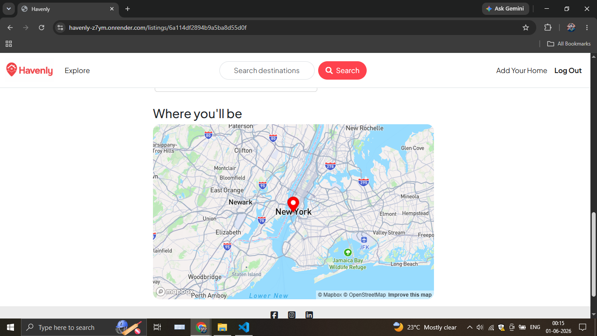

# 🏡 Havenly

### A Full-Stack Travel & Accommodation Booking Platform

Havenly is a modern Airbnb-inspired web application that enables users to discover unique stays, list their own properties, share reviews, and explore locations through interactive maps.

Built using the MERN ecosystem and modern web technologies, Havenly provides a seamless booking and property management experience.

---

## 🌐 Live Demo

🔗 **Website:** https://havenly-z7ym.onrender.com/listings

---

## 📸 Screenshots

Home Page



Listing Details Page



Create Listing Page



Edit Listing Page



Review Listing Page



Login Page



Signup Page



Interactive Map View



---

## ✨ Features

### 🔐 Authentication & Security

* User Registration & Login
* Secure Authentication with Passport.js
* Session Management using Mongo Store
* Protected Routes & Authorization

### 🏡 Property Listings

* Create New Listings
* Edit Existing Listings
* Delete Listings
* View Detailed Property Information
* Responsive Property Cards

### 🖼️ Media Management

* Upload Property Images
* Cloudinary Cloud Storage Integration
* Optimized Image Delivery

### 🗺️ Maps & Location Services

* Interactive Maps using Mapbox
* Automatic Location Geocoding
* Property Location Visualization

### ⭐ Reviews & Ratings

* Add Reviews
* Property Rating System
* Review Management

### 💻 User Experience

* Responsive Design
* Mobile-Friendly Interface
* Bootstrap-Powered UI
* Flash Messages & Notifications
* Server-Side Validation

---

## 🚀 Tech Stack

### ✒ Frontend

* HTML5
* CSS3
* Bootstrap
* EJS
* JavaScript

### ⚙️ Backend

* Node.js
* Express.js

### 🗄️ Database

* MongoDB Atlas
* Mongoose ODM

### 🔐 Authentication & Storage

* Passport.js
* Cloudinary
* Multer
* Connect-Mongo

### 🗺️ APIs & Integrations

* Mapbox Geocoding API
* Mapbox GL JS

---

## 📂 Project Highlights

✅ Full-Stack Web Application

✅ Authentication & Authorization

✅ Cloud-Based Image Storage

✅ Interactive Maps Integration

✅ CRUD Operations

✅ RESTful Architecture

✅ Responsive Design

---

## Installation

```bash
git clone https://github.com/AvishekAmin/havenly.git
cd havenly
npm install
nodemon app.js
```

---

## Environment Variables

Create a `.env` file in the root directory:

```env
ATLASDB_URL=your_mongodb_atlas_connection_string

SECRET=your_session_secret

CLOUD_NAME=your_cloudinary_cloud_name
CLOUD_API_KEY=your_cloudinary_api_key
CLOUD_API_SECRET=your_cloudinary_api_secret

MAP_TOKEN=your_mapbox_access_token
```

---

## Project Structure

```text
havenly/
│
├── controllers/
│   ├── listing.js
│   ├── review.js
│   └── user.js
│
├── init/
│   ├── data.js
│   └── index.js
│
├── models/
│   ├── listing.js
│   ├── review.js
│   └── user.js
│
├── public/
│   ├── css/
│   │   ├── style.css
│   │   └── rating.css
│   │
│   ├── images/
│   │   └── havenly-logo.png
│   │
│   └── js/
│       ├── map.js
│       └── script.js
│
├── routes/
│   ├── listing.js
│   ├── review.js
│   └── user.js
│
├── utils/
│   ├── ExpressError.js
│   └── wrapAsync.js
│
├── views/
│   ├── includes/
│   │   ├── navbar.ejs
│   │   ├── footer.ejs
│   │   └── flash.ejs
│   │
│   ├── layouts/
│   │   └── boilerplate.ejs
│   │
│   ├── listings/
│   │   ├── index.ejs
│   │   ├── show.ejs
│   │   ├── new.ejs
│   │   └── edit.ejs
│   │
│   ├── users/
│   │   ├── login.ejs
│   │   └── signup.ejs
│   │
│   └── error.ejs
│
├── middleware.js
├── cloudConfig.js
├── schema.js
├── app.js
├── package.json
├── package-lock.json
├── .env
├── .gitignore
├── README.md
│
├── screenshot-home-page.png
├── screenshot-show-page.png
├── screenshot-create-listing.png
├── screenshot-edit-page.png
├── screenshot-login-page.png
├── screenshot-signup-page.png
└── screenshot-map-location.png
```

---

## 👨‍💻 Author

### Avishek Amin

🔗 LinkedIn: https://www.linkedin.com/in/avishekamin

🔗 Email: avishekamin207@gmail.com

🔗 GitHub: https://github.com/AvishekAmin

---

### ⭐ If you like this project, consider giving it a star!

---
