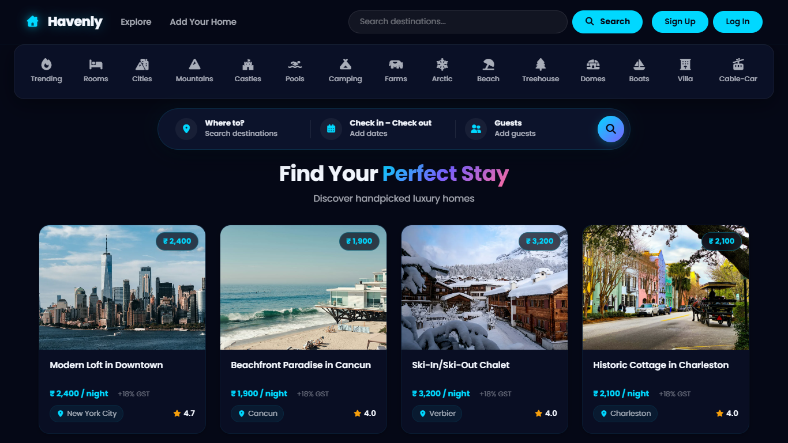
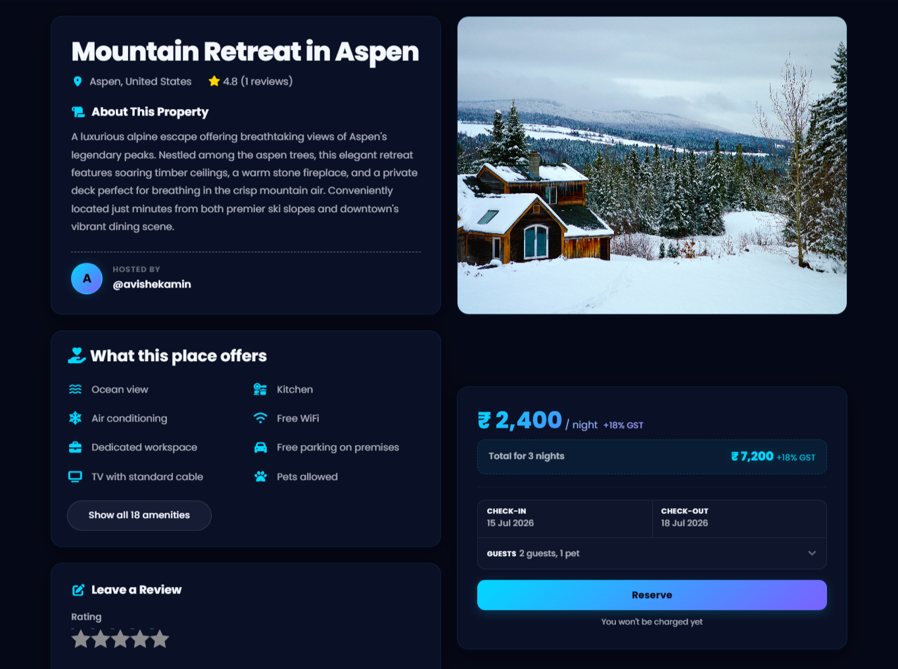
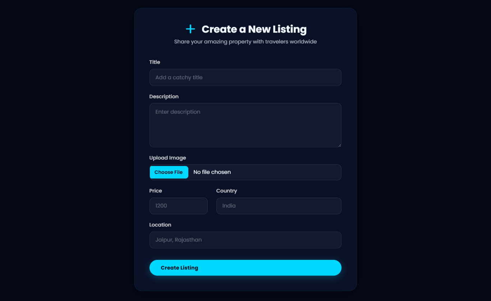
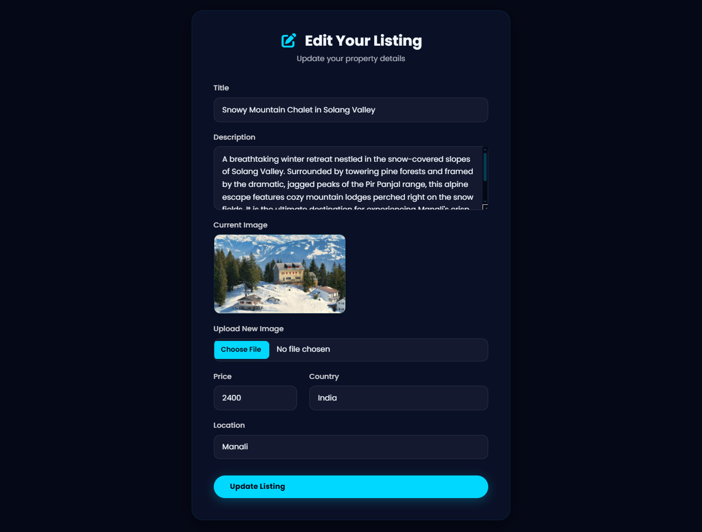
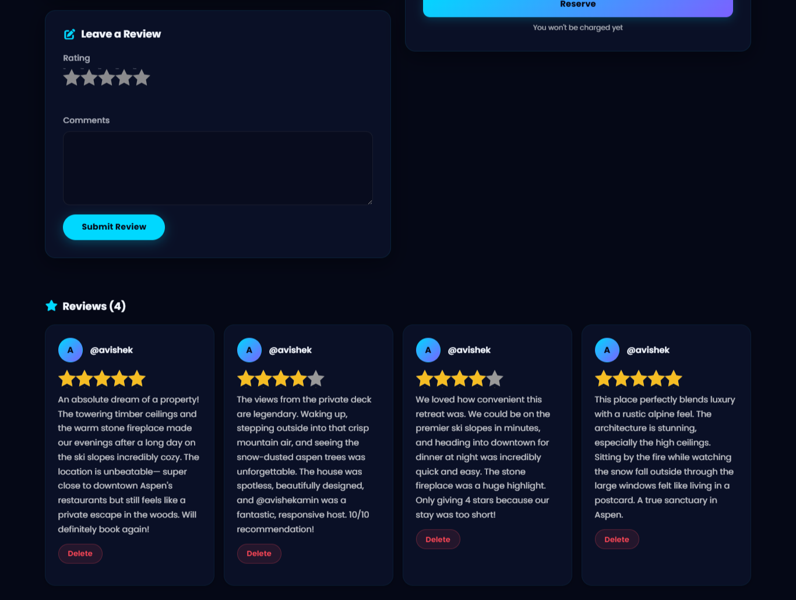
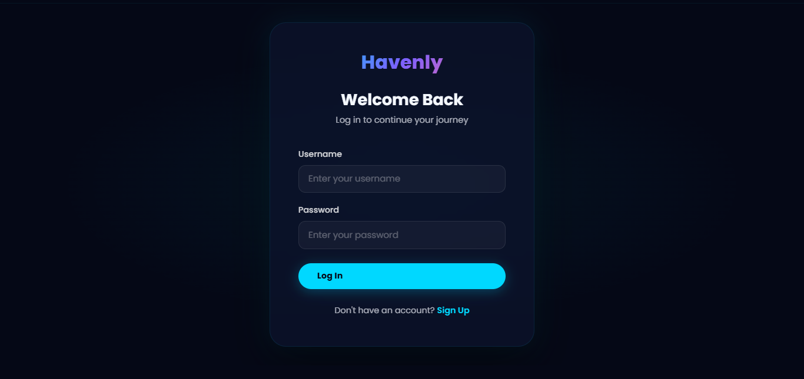
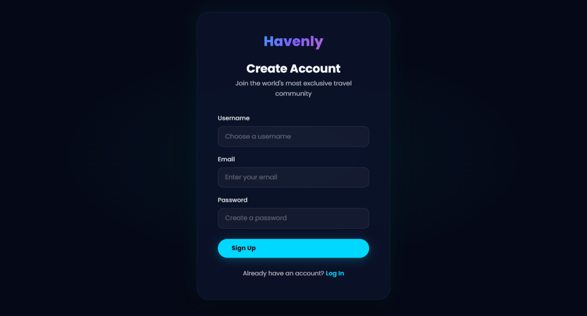
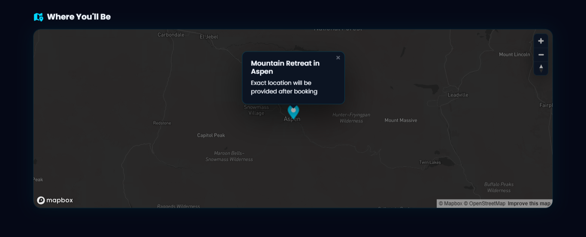
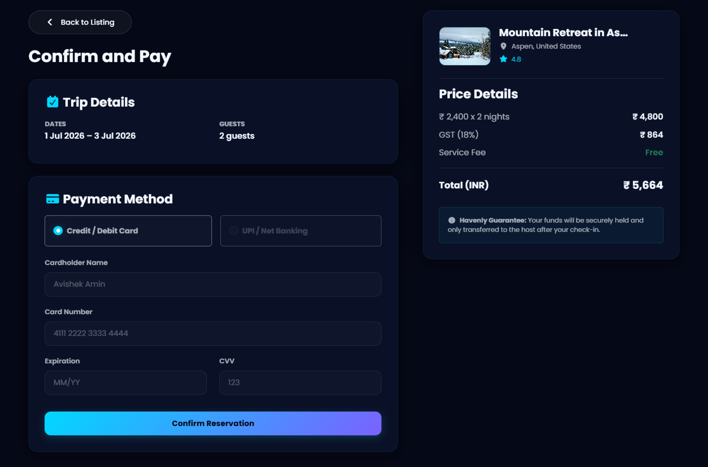

# 🏡 Havenly

## A Travel & Accommodation Booking Platform

Havenly is a modern full-stack travel and accommodation booking platform designed to connect travelers with exceptional places to stay. Users can explore destinations, discover unique properties, create and manage listings, share reviews, and navigate locations through interactive maps.

Powered by the MERN stack and modern web technologies, Havenly offers a secure, scalable, and responsive experience with authentication, cloud-based image management, interactive maps, advanced search, review management, and an elegant user interface inspired by contemporary booking platforms.

---

# 🌐 Live Demo

🔗 Website:
https://havenly-z7ym.onrender.com/listings

---

# 📷 Screenshots

## 1. Home Page


## 2. Show Page


## 3. Create Listing


## 4. Edit Listing


## 5. Review Listing


## 6. Login Page


## 7. Signup Page


## 8. Map Location


## 9. Payment Page


---

# ✨ Features

## 🔐 Authentication & Security

- User Registration & Login
- Secure Authentication with Passport.js
- Session Management using Mongo Store
- Protected Routes & Authorization

## 🏡 Property Listings

- Create New Listings
- Edit Existing Listings
- Delete Listings
- View Detailed Property Information
- Responsive Property Cards

## 🖼️ Media Management

- Upload Property Images
- Cloudinary Cloud Storage Integration
- Optimized Image Delivery

## 🗺️ Maps & Location Services

- Interactive Maps using Mapbox
- Automatic Location Geocoding
- Property Location Visualization

## ⭐ Reviews & Ratings

- Add Reviews
- Property Rating System
- Review Management

## 💻 User Experience

- Responsive Design
- Mobile-Friendly Interface
- Bootstrap-Powered UI
- Flash Messages & Notifications
- Server-Side Validation

---

# 🚀 Tech Stack

## 🖌️ Frontend

- HTML5
- CSS3
- Bootstrap
- EJS
- JavaScript

## ⚙️ Backend

- Node.js
- Express.js

## 🗄️ Database

- MongoDB Atlas
- Mongoose ODM

## 🔐 Authentication & Storage

- Passport.js
- Cloudinary
- Multer
- Connect-Mongo

## 🗺️ APIs & Integrations

- Mapbox Geocoding API
- Mapbox GL JS

---

# 📁 Project Highlights

✅ Full-Stack Web Application

✅ Authentication & Authorization

✅ Cloud-Based Image Storage

✅ Interactive Maps Integration

✅ CRUD Operations

✅ RESTful Architecture

✅ Responsive Design

---

# 🔑 Installation

```bash
git clone https://github.com/AvishekAmin/havenly.git
cd havenly
npm install
nodemon app.js
```

---

# 🛠️ Environment Variables

Create a `.env` file in the root directory:

```env
ATLASDB_URL=your_mongodb_atlas_connection_string

SECRET=your_session_secret

CLOUD_NAME=your_cloudinary_cloud_name
CLOUD_API_KEY=your_cloudinary_api_key
CLOUD_API_SECRET=your_cloudinary_api_secret

MAP_TOKEN=your_mapbox_access_token
```

---

## 📁 Project Structure

```text
havenly/
│
├── controllers/
│   ├── listing.js
│   ├── review.js
│   └── user.js
│
├── init/
│   ├── data.js
│   └── index.js
│
├── models/
│   ├── listing.js
│   ├── review.js
│   └── user.js
│
├── public/
│   ├── css/
│   │   ├── style.css
│   │   └── rating.css
│   └── js/
│       ├── map.js
│       └── script.js
│
├── routes/
│   ├── listing.js
│   ├── review.js
│   └── user.js
│
├── utils/
│   ├── ExpressError.js
│   └── wrapAsync.js
│
├── views/
│   ├── includes/
│   │   ├── navbar.ejs
│   │   ├── footer.ejs
│   │   └── flash.ejs
│   │
│   ├── layouts/
│   │   └── boilerplate.ejs
│   │
│   ├── listings/
│   │   ├── index.ejs
│   │   ├── show.ejs
│   │   ├── new.ejs
│   │   ├── edit.ejs
│   │   └── payment.ejs
│   │
│   ├── users/
│   │   ├── login.ejs
│   │   └── signup.ejs
│   │
│   └── error.ejs
│
├── screenshots/
│   ├── home-page.png
│   ├── show-page.png
│   ├── create-listing.png
│   ├── edit-listing.png
│   ├── review-listing.png
│   ├── login-page.png
│   ├── signup-page.png
│   ├── map-location.png
│   └── payment-page.png
│
├── .env
├── .gitignore
├── app.js
├── cloudConfig.js
├── middleware.js
├── package.json
├── package-lock.json
├── README.md
└── schema.js
```

---

# 👨‍💻 Author

## Avishek Amin

🔗 LinkedIn:
https://www.linkedin.com/in/avishekamin

🔗 Email:
avishekamin207@gmail.com

🔗 GitHub:
https://github.com/AvishekAmin

---

### ⭐ **If you like this project, consider giving it a star!**

---