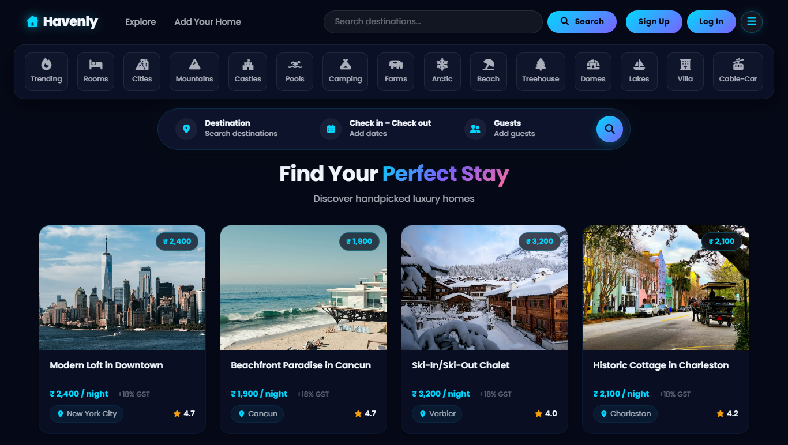
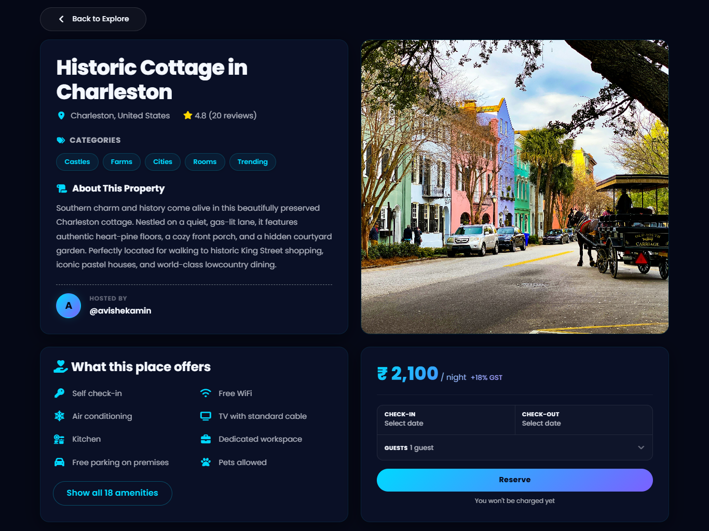
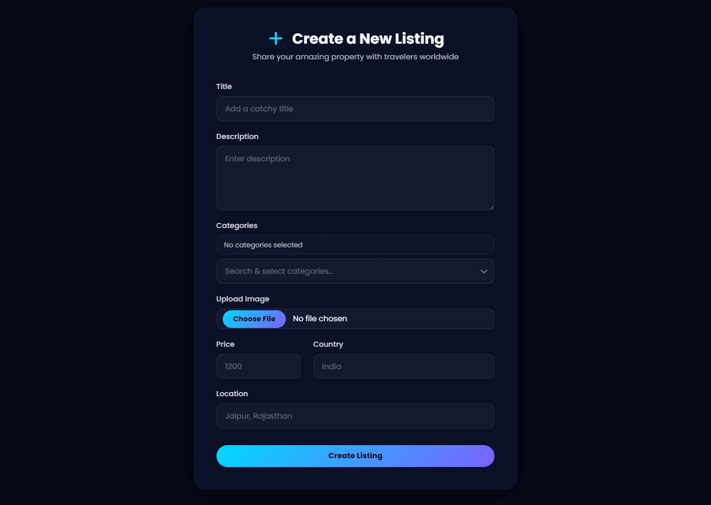
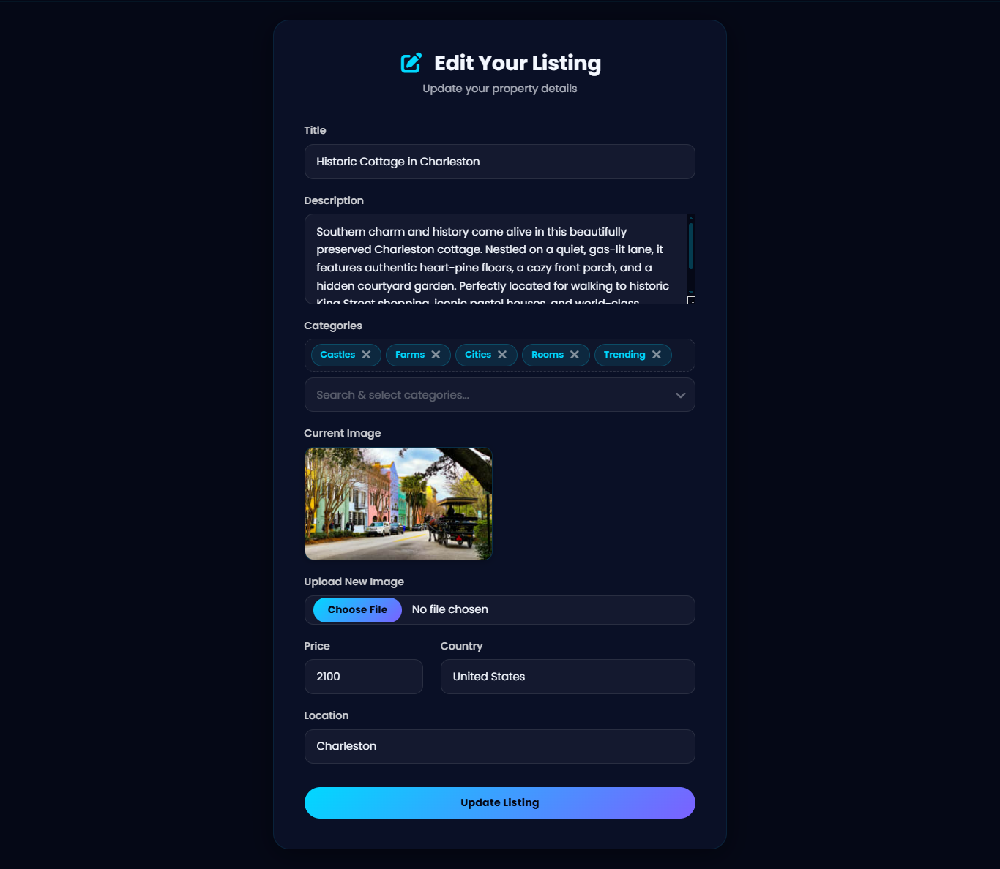
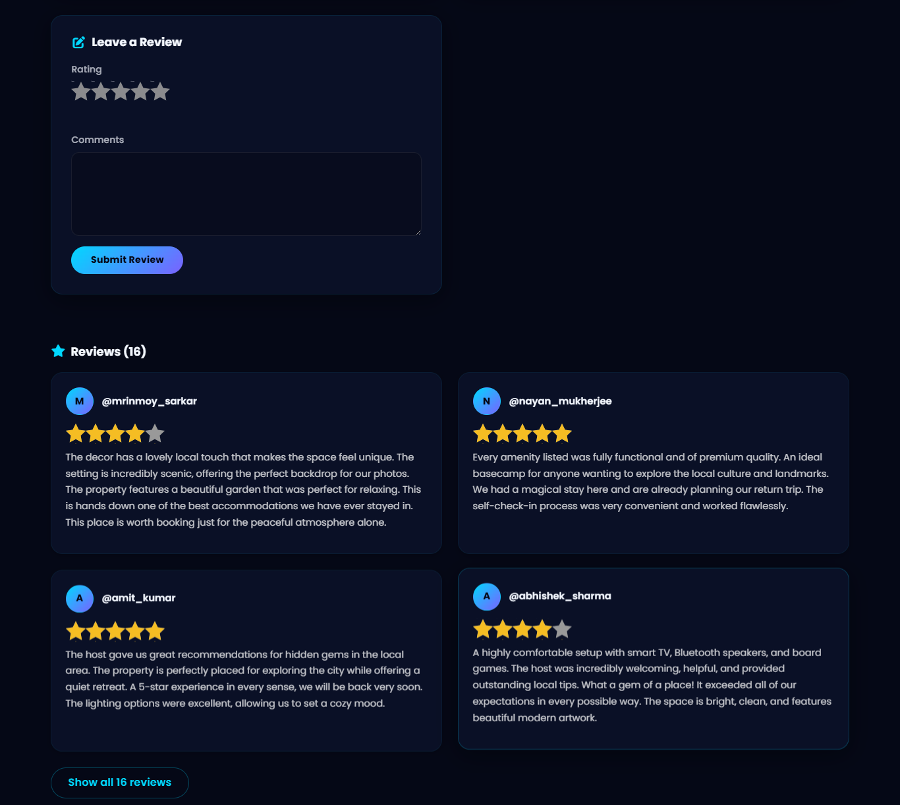
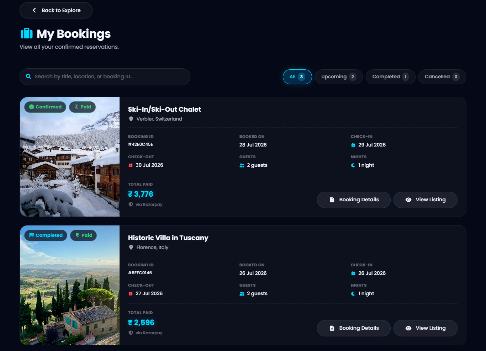
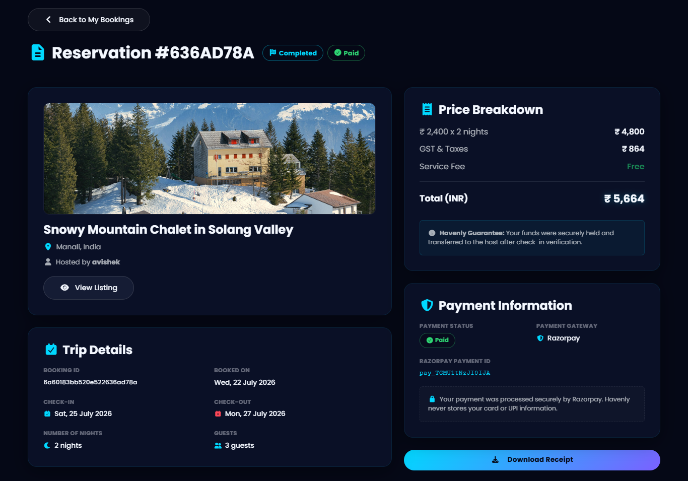
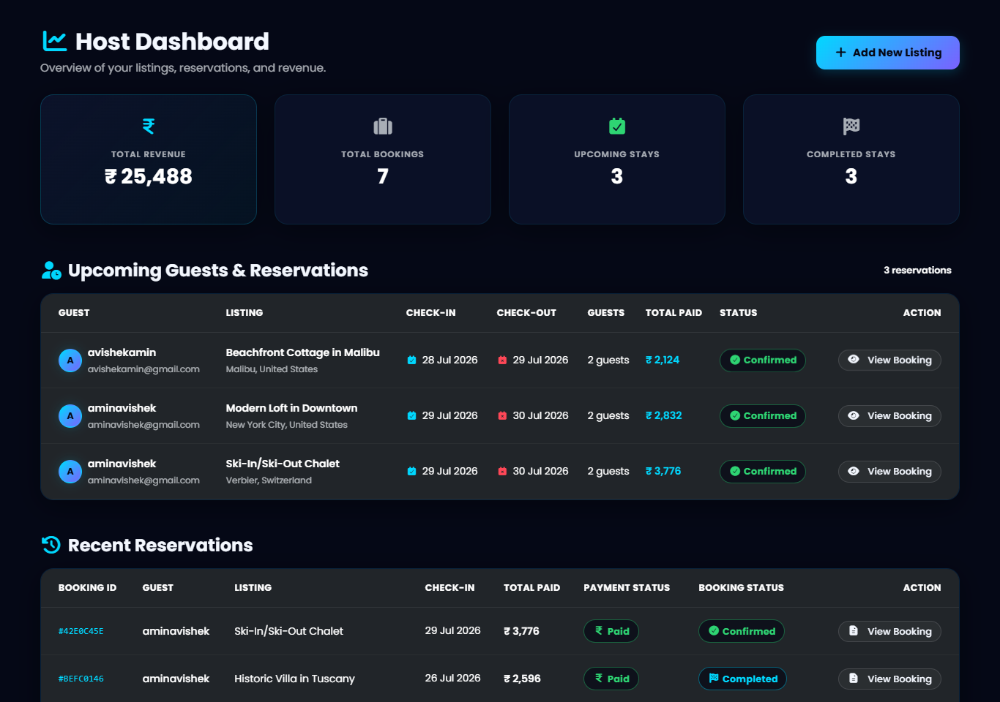
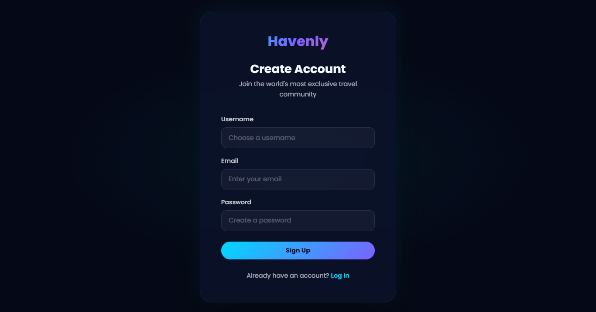

# 🏡 Havenly: Travel & Accommodation Booking Platform

[](https://nodejs.org/)
[](https://expressjs.com/)
[](https://www.mongodb.com/atlas)
[](https://razorpay.com/)
[](https://cloudinary.com/)
[](https://www.mapbox.com/)
[](LICENSE)

**Havenly** is an enterprise-grade, production-ready travel and accommodation booking platform built with **Node.js**, **Express 5**, **MongoDB Atlas**, **Mongoose**, **EJS-Mate**, and **Bootstrap 5**. Designed to provide an end-to-end luxury hospitality experience for travelers and hosts alike, Havenly combines intelligent destination discovery, conflict-free reservation scheduling, cryptographic payment verification, dynamic vector invoice streaming, and real-time host revenue intelligence — all presented in an immersive dark glassmorphism aesthetic.

From discovering handpicked villas and alpine chalets to booking stays with instant price computation, Razorpay checkout, automated email confirmations, and downloadable PDF receipts, Havenly delivers a robust marketplace experience engineered with rigorous security and transactional integrity.

---

## 🌐 Live Deployment

- 🔗 **Production Web Application:** [https://havenly-avishek.onrender.com/listings](https://havenly-avishek.onrender.com/listings)

> ⚠️ **Note on Render Free Tier:** The web application is hosted on Render's free compute tier, which automatically spins down when idle. The initial visit or login after inactivity may take 20–30 seconds while the container boots. Subsequent interactions will execute at full speed.

---

## 🎯 Architectural Pillars

1. **Robust MVC Layered Architecture**: Clean separation between routes, middleware, controllers, data models, and EJS views with centralized async error handling (`wrapAsync`), custom error utilities (`ExpressError`), and schema validation via Joi.
2. **Double-Checked Concurrency & Availability Engine**: Atomic availability validation preventing overlapping reservations during initial checkout creation, re-verified at payment signature capture to eliminate multi-tab race conditions.
3. **Cryptographic Payment & Session Security**: Server-side Razorpay order generation with HMAC SHA-256 signature verification, host self-booking prevention, strict IDOR ownership checks, and rolling session cookies backed by MongoDB Atlas (`connect-mongo`).
4. **Dynamic Document & Notification Pipelines**: High-fidelity vector PDF invoices generated on-the-fly with PDFKit and streamed directly via HTTP response, coupled with automated asynchronous Nodemailer booking confirmations.
5. **Spatial Exploration & Media Optimization**: Mapbox GL JS forward geocoding for coordinates visualization, paired with Cloudinary cloud media storage and automated image transformations.

---

## 🏗️ System Architecture

Havenly separates user interactions, media delivery, geospatial processing, and secure transaction pipelines into a unified, high-reliability architecture:

### High-Level Topology

```text
                                  ┌──────────────────────────────────────────┐
                                  │            Client (Browser)              │
                                  │                                          │
                                  │  EJS-Mate + Bootstrap 5 + Glassmorphism  │
                                  │  - Interactive Reservation Widget        │
                                  │  - Category Filter Bar & Hero Banners    │
                                  │  - Razorpay Checkout Modal               │
                                  │  - Mapbox GL JS Spatial Viewer           │
                                  └─────────────┬────────────────────────────┘
                                                │
                                                │ HTTPS (REST / Forms / AJAX)
                                                ▼
         ┌─────────────────────────────────────────────────────────────────────────┐
         │                          Express 5.x Server                             │
         │                                                                         │
         │  - Trust Proxy (Render SSL)        - MongoStore Session (7-Day Rolling) │
         │  - Method Override (_method)       - Flash Messaging (Connect-Flash)    │
         │  - Passport.js Local Strategy      - Joi Schema Validation Middleware   │
         │  - Centralized Error Handler       - Ownership & Role Guards            │
         └──────────┬──────────────┬──────────────┬──────────────┬─────────────┬───┘
                    │              │              │              │             │
                    ▼              ▼              ▼              ▼             ▼
       ┌────────────────┐  ┌──────────────┐ ┌──────────┐ ┌─────────────┐ ┌───────────────┐
       │ MongoDB Atlas  │  │   Razorpay   │ │Cloudinary│ │ Mapbox API  │ │Nodemailer/SMTP│
       │ (Mongoose 9.2) │  │ Payment APIs │ │  Media   │ │  Geocoding  │ │Confirmation   │
       │ Listings/Users │  │ Orders & HMAC│ │ Storage  │ │ Forward Geo │ │   Emails      │
       │ Bookings/Review│  │ Verification │ │  Uploads │ │ Coordinates │ │  Deliveries   │
       └────────────────┘  └──────────────┘ └──────────┘ └─────────────┘ └───────────────┘
```

### Detailed Component Interaction

```text
+----------------------------------------------------------------------------------------------------+
| CLIENT APPLICATION (Browser)                                                                       |
|                                                                                                    |
|  +--------------------+   +-----------------------+   +--------------------+   +----------------+  |
|  | Search & Filter    |   | Reservation Widget    |   | Razorpay Modal     |   | Mapbox GL JS   |  |
|  | Multi-Category Bar |-->| Dates, Guests, Price  |-->| Standard SDK Form  |-->| Interactive Pin|  |
|  | Destination Query  |   | Overlap Pre-Check     |   | Signature Capture  |   | Coordinates    |  |
|  +--------------------+   +-----------------------+   +--------------------+   +----------------+  |
+---------------------------------------|-------------------------|----------------------------------+
                                        |                         |
                             HTTPS REST |              AJAX POST  |
                                        v                         v
+----------------------------------------------------------------------------------------------------+
| BACKEND APPLICATION (Node.js / Express 5)                                                          |
|                                                                                                    |
|  [Middleware Pipeline]                                                                             |
|  Static Serve -> URL-Encoded / JSON Parser -> Method Override -> Session -> Passport -> Flash      |
|                                                                                                    |
|  [REST Controllers & Guards]                                                                       |
|  - listingController (CRUD, Mapbox Geocoding, Category Filter, Search)                             |
|  - bookingController (Order Creation, Availability Lock, HMAC SHA-256 Verification, Cancellation)  |
|  - hostController    (Revenue Aggregation Pipeline, Reservation Counts, Metric Analytics)          |
|  - reviewController  (Joi Validation, Ownership Guards, Star Rating Cascade)                       |
|  - userController    (Passport Local Authentication, Redirect Preservation, Session Flush)         |
|                                                                                                    |
|  [Service & Utility Engines]                                                                       |
|  - bookingCalculator.js (Base Price, Number of Nights, 18% GST Breakdown)                          |
|  - receiptGenerator.js  (PDFKit Vector Invoice Streamer)                                           |
|  - emailService.js      (Nodemailer HTML Template Dispatcher)                                      |
|  - bookingSync.js       (Automatic Checkout Date -> 'Completed' Status Reconciliation)             |
+---------------------------------------|-------------------------|----------------------------------+
                                        |                         |
                       Database Queries |        External Gateway |
                                        v                         v
+-----------------------------------------------+        +-------------------------------------------+
| MONGODB ATLAS CLUSTER                         |        | THIRD-PARTY SERVICE INFRASTRUCTURE        |
| - Users Collection (Passport Hashes & Salts)  |        | - Razorpay API (Order Minting & HMAC)     |
| - Listings Collection (GeoJSON Points, Media) |        | - Cloudinary (Image Cloud Transformation) |
| - Bookings Collection (Date-Bounded Indices)  |        | - Mapbox Geocoding (Forward Coordinates)  |
| - Reviews Collection (Cascade Delete Hooked)  |        | - Gmail SMTP (Booking Confirmation Mail)  |
+-----------------------------------------------+        +-------------------------------------------+
```

---

## 🔄 End-to-End Booking & Payment Lifecycle

```text
Traveler (Browser)                 Havenly Server                     Razorpay Gateway
       │                                 │                                   │
       │── 1. Select Dates & Guests ────>│                                   │
       │   POST /bookings/create-order   │                                   │
       │                                 │── 2. Validate availability        │
       │                                 │      Check host self-booking      │
       │                                 │      Compute base price + 18% GST │
       │                                 │                                   │
       │                                 │── 3. orders.create({ amount }) ──>│
       │                                 │<─ 4. Order ID returned ───────────│
       │                                 │                                   │
       │                                 │── 5. Save Booking (Pending)       │
       │<─ 6. Return orderId & summary ──│                                   │
       │                                 │                                   │
       │── 7. Launch Razorpay Checkout Modal ───────────────────────────────>│
       │<─ 8. Payment authorization, payment_id & signature returned ────────│
       │                                 │                                   │
       │── 9. POST /bookings/verify-payment ────────────────────────────────>│
       │      { order_id, payment_id, signature }                            │
       │                                 │                                   │
       │                                 │── 10. Verify HMAC SHA-256 Sign.   │
       │                                 │   11. Atomic double-check overlap │
       │                                 │   12. Update Booking -> Confirmed │
       │                                 │   13. Trigger Nodemailer (Async)  │
       │                                 │                                   │
       │<─ 14. Redirect to /bookings/:id │                                   │
       │                                 │                                   │
       │── 15. GET /bookings/:id/receipt │                                   │
       │<─ 16. Stream PDFKit Invoice ────│                                   │
```

---

## ✨ Feature Deep-Dive

### 🔍 1. Smart Discovery, Search & Dynamic Categories
- **15 Curated Categories**: Instant filtering across *Trending, Rooms, Cities, Mountains, Castles, Pools, Camping, Farms, Arctic, Beach, Treehouse, Domes, Lakes, Villa, and Cable-Car*.
- **Dynamic Contextual Hero Banners**: Selecting a category updates the hero title, subtitle, and gradient accents dynamically to reflect the travel genre.
- **Smart Destination Filtering**: Interactive search bar with auto-advancing destination, calendar dates, and guest dropdowns.
- **Responsive Listing Grid**: Responsive card layout featuring lazy-loaded Cloudinary imagery, formatted Indian Rupee (`₹`) pricing, tax toggling, and location badges.

### 📅 2. Reservation Engine & Concurrency Protection
- **Dynamic Pricing Engine**: Computes exact stay duration across check-in/check-out dates, calculates nightly base price, and computes accurate 18% GST.
- **Host Self-Booking Firewall**: Hosts are strictly forbidden from booking their own listings, preventing self-dealing and metric skewing.
- **Atomic Overlap Detection**: Enforces non-overlapping date reservations using MongoDB date queries (`checkIn < requestedCheckOut` AND `checkOut > requestedCheckIn`).
- **Two-Phase Verification**: Availability is checked during order generation and re-validated at payment verification to eliminate race conditions.

### 💳 3. Razorpay Payment Gateway & Cryptographic Security
- **Server-Minted Orders**: Order creation occurs strictly on the server with verified parameters to prevent client-side price tampering.
- **HMAC SHA-256 Signature Verification**: Uses Node.js native `crypto` module to verify that `razorpay_order_id`, `razorpay_payment_id`, and `razorpay_signature` match the server secret.
- **Idempotent Status Lifecycle**: Reservations cleanly transition across `Pending` ➔ `Paid` ➔ `Failed` payment statuses and `Confirmed` ➔ `Completed` ➔ `Cancelled` reservation lifecycles.

### 📄 4. PDF Receipts & Automated Email Notifications
- **On-the-Fly PDFKit Streaming**: Dynamically draws a professional vector invoice (header, booking reference, property details, itemized breakdown, tax details, host contact) and streams it directly to the browser without disk bloat.
- **Instant Booking Confirmation Emails**: Dispatches a comprehensive HTML email via Nodemailer with reservation details, property location, check-in instructions, and payment receipts.
- **Graceful Email Fallback**: Email transmission runs asynchronously; transient SMTP issues never abort confirmed bookings.

### 👨‍💼 5. Host Operations & Analytics Dashboard
- **Revenue Aggregation Pipeline**: Uses MongoDB aggregation (`$match`, `$group`, `$sum`) to compute accurate total earnings from paid, non-cancelled bookings.
- **Reservation Breakdown**: High-level KPI tiles display total bookings count, upcoming reservations, and completed stays.
- **Live Reservation Lists**: Segmented tables show upcoming guests with check-in schedules alongside the 10 most recent bookings with guest contact information.
- **Automatic Status Synchronization**: Automatically promotes past `Confirmed` bookings to `Completed` when the checkout timestamp has elapsed.

### ⭐ 6. Reviews, Ratings & Sortable Modal
- **Star Rating System**: Intuitive interactive 5-star rating widget for guests who have experienced a stay.
- **Multi-Factor Sorting**: Reviews modal enables sorting by **Most Recent**, **Highest Rated**, and **Lowest Rated**.
- **Authorization Guard**: Reviews can only be deleted by their original author, enforced via `isReviewAuthor` middleware.
- **Mongoose Cascade Deletion**: Deleting a listing triggers a post middleware hook that cascades and removes all associated reviews from the database.

### 🗺️ 7. Mapbox GL JS Spatial Mapping
- **Forward Geocoding**: Automatically converts text addresses (`location`, `country`) into high-precision latitude and longitude coordinates during listing creation.
- **Interactive Pinning**: Renders a customized dark-mode Mapbox GL JS map on the property detail page with responsive zoom, controls, and popup cards.

### 🎨 8. Dark Glassmorphism Design System
- **Deep Space Aesthetic**: Custom CSS architecture built with `#050816` canvas backgrounds, frosted glass surfaces (`backdrop-filter: blur(16px)`), subtle borders (`rgba(255,255,255,0.08)`), and dual neon glows (`#00d8f6` cyan & `#7b61ff` purple).
- **Smooth Action Buttons**: Consistent pill-shaped CTA buttons with glowing hover states, fluid transitions, and tactile feedback.
- **Device Responsiveness**: Dedicated layout adjustments for mobile viewports (`≤ 991px`) and desktop viewports (`≥ 992px`), including collapsible navigation drawers and responsive modals.

### 📑 9. Dedicated Informational & Support Pages
- **Help Center** (`/help-center`): Comprehensive FAQ accordion covering booking workflows, payments, and account administration.
- **Safety Guidelines** (`/safety`): Security promises, verified host information, and guest safety tips.
- **Cancellation Policies** (`/cancellation`): Multi-tiered cancellation policies (Flexible, Moderate, Strict) with timeline specifications.
- **Contact Desk** (`/contact`): Inquiry form with direct office coordinates, operating hours, and customer support channels.
- **Company Pages**: Dedicated About (`/about`), Careers (`/careers`), Press & Media (`/press`), and Terms & Privacy (`/terms-and-privacy`) routes.

---

## 📷 Screenshots

### 1. Home Page & Category Navigation


### 2. Property Showcase & Reservation Widget


### 3. Interactive Mapbox Location Pin


### 4. Create New Listing


### 5. Edit Existing Listing


### 6. Ratings & Property Reviews


### 7. Filtered Reviews Overview Modal


### 8. Razorpay Payment Gateway Checkout


### 9. Traveler Bookings Hub (My Bookings)


### 10. Booking Details & PDF Receipt Download


### 11. Host Revenue & Reservation Dashboard


### 12. User Authentication (Login)


### 13. New Account Registration (Signup)


---

## 🚀 Tech Stack

### Frontend Architecture
- **Templating Engine:** [EJS](https://ejs.co/) + [EJS-Mate](https://github.com/Bogdan-Lyashenko/ejs-mate) (Layout inheritance & modular partials)
- **UI Framework:** [Bootstrap 5.3](https://getbootstrap.com/) (Grid system, modals, forms, dropdowns)
- **Custom Styling:** Custom CSS3 with Dark Glassmorphism, CSS Grid, and Neon Glow Effects
- **Mapping Library:** [Mapbox GL JS v3](https://www.mapbox.com/mapbox-gljs) (Interactive vector maps & markers)
- **Icons:** [Font Awesome 6 Free](https://fontawesome.com/)
- **Typography:** [Plus Jakarta Sans](https://fonts.google.com/specimen/Plus+Jakarta+Sans) & [Poppins](https://fonts.google.com/specimen/Poppins)

### Backend Architecture
- **Runtime Environment:** [Node.js](https://nodejs.org/) (CommonJS modules, Engine: 20+)
- **Application Framework:** [Express.js 5.2](https://expressjs.com/) (Layered MVC architecture)
- **Authentication:** [Passport.js](https://www.passportjs.org/) + [passport-local](https://github.com/jaredhanson/passport-local) + [passport-local-mongoose](https://github.com/saintedlama/passport-local-mongoose)
- **Session Management:** [express-session](https://github.com/expressjs/session) + [connect-mongo 6.0](https://github.com/jdesboeufs/connect-mongo) (Encrypted Atlas session store)
- **Schema Validation:** [Joi 18.0](https://joi.dev/) (Strict server-side validation schemas)
- **File Uploads:** [Multer 2.1](https://github.com/expressjs/multer) + [multer-storage-cloudinary 4.0](https://github.com/richardgirges/express-multer-storage-cloudinary)
- **PDF Generation:** [PDFKit 0.19](https://pdfkit.org/) (Vector receipts & dynamic invoices)
- **Email Delivery:** [Nodemailer 9.0](https://nodemailer.com/) (SMTP transport with HTML receipt templates)

### Database & External Services
- **Database:** [MongoDB Atlas](https://www.mongodb.com/atlas) (Cloud multi-region cluster)
- **Object Modeling:** [Mongoose 9.2](https://mongoosejs.com/) (Validation, references, cascade delete hooks)
- **Payment Processing:** [Razorpay Node SDK 2.9](https://github.com/razorpay/razorpay-node)
- **Media Cloud:** [Cloudinary](https://cloudinary.com/) (Automated image hosting and resizing)
- **Spatial Geocoding:** [@mapbox/mapbox-sdk 0.16](https://github.com/mapbox/mapbox-sdk-js) (Forward geocoding client)
- **Hosting Platform:** [Render](https://render.com/)

---

## 📁 Project Structure

```text
havenly/
│
├── constants/
│   └── categories.js             # Master category definitions & icons
│
├── controllers/
│   ├── booking.js                # Order minting, payment verification, PDF generation, cancellation
│   ├── host.js                   # Host revenue pipeline, booking counts, guest schedules
│   ├── listing.js                # Listing CRUD, Mapbox geocoding, category filters
│   ├── review.js                 # Review creation, deletion, and cascade management
│   └── user.js                   # Registration, login authentication, and logout session handling
│
├── init/
│   ├── data.js                   # Comprehensive demo dataset of global luxury properties
│   ├── index.js                  # Master DB reset & geocoding seed script
│   ├── seedCategories.js         # Keyword-based category classification seeder
│   └── seedReviews.js            # Combinatoric review generator with realistic ratings
│
├── models/
│   ├── booking.js                # Booking schema with date spans, statuses, and Razorpay references
│   ├── listing.js                # Property schema with GeoJSON coordinates & review references
│   ├── review.js                 # Review schema with 1-5 star ratings & author attribution
│   └── user.js                   # User schema with Passport-Local-Mongoose plugin
│
├── public/
│   ├── css/
│   │   └── style.css             # Unified dark glassmorphism stylesheet & responsive media queries
│   ├── images/
│   │   └── favicon/
│   │       ├── apple-touch-icon.png  # Apple touch icon asset
│   │       ├── favicon.ico           # Legacy multi-resolution browser icon
│   │       └── favicon.svg           # Scalable vector favicon
│   └── js/
│       ├── calendar.js           # Interactive reservation date range selection logic
│       ├── map.js                # Mapbox GL JS map rendering & coordinates marker logic
│       └── script.js             # Bootstrap validation & client-side UI interactions
│
├── routes/
│   ├── booking.js                # Routes for /bookings (create-order, verify-payment, receipt, cancel)
│   ├── host.js                   # Routes for /host/dashboard
│   ├── listing.js                # RESTful routes for /listings (index, show, create, edit, delete)
│   ├── pages.js                  # Routes for informational & legal pages
│   ├── review.js                 # Nested routes for /listings/:id/reviews
│   └── user.js                   # Routes for /signup, /login, and /logout
│
├── screenshots/
│   ├── booking_details.png       # Booking confirmation, host info & PDF receipt link
│   ├── create_listing.png        # New listing creation form with category selectors
│   ├── edit_listing.png          # Property update form with image replacement preview
│   ├── home_page.png             # Home catalog with dynamic category navigation
│   ├── host_dashboard.png        # Host revenue analytics & reservation activity tables
│   ├── login_page.png            # User login interface
│   ├── map_location.png          # Interactive Mapbox GL JS map integration
│   ├── my_bookings.png           # User reservation management (upcoming & completed)
│   ├── payment_page.png          # Razorpay checkout modal & price breakdown
│   ├── review_listing.png        # Star rating submission & review section
│   ├── review_modal.png          # Full review modal with dynamic sorting options
│   ├── show_page.png             # Property showcase with sticky booking widget
│   └── signup_page.png           # User registration interface
│
├── utils/
│   ├── bookingCalculator.js      # Night count, base price, and 18% GST calculation logic
│   ├── bookingSync.js            # Automated checkout date reconciliation helper
│   ├── emailService.js           # Nodemailer booking confirmation dispatcher
│   ├── ExpressError.js           # Custom operational error wrapper
│   ├── receiptGenerator.js       # PDFKit on-the-fly invoice generator
│   └── wrapAsync.js              # Higher-order async route wrapper
│
├── views/
│   ├── bookings/
│   │   ├── my-bookings.ejs       # Traveler reservation portal with upcoming/completed tabs
│   │   └── show.ejs              # Detailed reservation invoice & PDF download trigger
│   ├── host/
│   │   └── dashboard.ejs         # Host performance analytics, revenue summary & guest list
│   ├── includes/
│   │   ├── flash.ejs             # Floating flash alerts (success, error)
│   │   ├── footer.ejs            # Glassmorphism footer with quick links & newsletter signup
│   │   └── navbar.ejs            # Responsive top bar with search dropdown & user profile menu
│   ├── layouts/
│   │   └── boilerplate.ejs       # Main EJS-Mate layout with CDN headers and scripts
│   ├── listings/
│   │   ├── edit.ejs              # Edit property form with image thumbnail replacement
│   │   ├── index.ejs             # Primary listing catalog with category filter ribbon
│   │   ├── new.ejs               # Create new listing form with multi-category selector
│   │   ├── payment.ejs           # Dedicated checkout screen with pricing summary
│   │   └── show.ejs              # Property showcase with Mapbox map, reviews, and booking widget
│   ├── pages/
│   │   ├── about.ejs             # Company mission, core values, and platform statistics
│   │   ├── cancellation.ejs      # Three-tier cancellation policies
│   │   ├── careers.ejs           # Culture, benefits, and open job roles
│   │   ├── contact.ejs           # Contact information, office address, and support form
│   │   ├── help.ejs              # Help Center with categorized FAQ items
│   │   ├── press.ejs             # Media mentions, press kits, and accolades
│   │   ├── privacy.ejs           # Terms of Service & Privacy Policy clauses
│   │   └── safety.ejs            # Safety commitment, emergency protocols & verified host standards
│   ├── users/
│   │   ├── login.ejs             # User login page with glassmorphism card
│   │   └── signup.ejs            # New account registration page
│   └── error.ejs                 # Graceful error display page
│
├── .env.example                  # Environment variables template
├── .gitignore                    # Git tracking ignore patterns
├── app.js                        # Express application entry point & middleware pipeline
├── cloudConfig.js                # Cloudinary SDK & Multer cloud storage configuration
├── middleware.js                 # Authentication, authorization, and Joi validation guards
├── package.json                  # Project dependencies, engines & scripts
├── package-lock.json             # Pinned dependency lockfile
├── razorpay.js                   # Razorpay payment gateway client instance
├── README.md                     # Comprehensive platform documentation
└── schema.js                     # Joi validation schemas for listings & reviews
```

---

## 🔌 RESTful Route Specification

### Property Listings (`/listings`)

| Method | Endpoint | Access | Description |
| :--- | :--- | :--- | :--- |
| `GET` | `/listings` | Public | Catalog view with category filters (`?category=Beach`) |
| `GET` | `/listings/new` | Logged In | Render create listing form with category options |
| `POST` | `/listings` | Logged In | Upload image, geocode location via Mapbox, and save listing |
| `GET` | `/listings/:id` | Public | Property showcase with reviews, Mapbox map, and booking widget |
| `GET` | `/listings/:id/edit` | Owner Only | Render edit form with pre-populated values and current photo |
| `PUT` | `/listings/:id` | Owner Only | Update listing fields and replace Cloudinary image if provided |
| `DELETE` | `/listings/:id` | Owner Only | Delete listing and cascade delete all associated reviews |
| `GET` | `/listings/:id/payment` | Logged In | Render checkout view for the property with Razorpay SDK |

### Bookings & Checkout (`/bookings`)

| Method | Endpoint | Access | Description |
| :--- | :--- | :--- | :--- |
| `POST` | `/bookings/create-order` | Logged In | Validates dates, checks host self-booking, creates Razorpay order |
| `POST` | `/bookings/verify-payment`| Logged In | Verifies HMAC SHA-256 signature, confirms booking, triggers email |
| `GET` | `/bookings/my-bookings` | Logged In | Traveler dashboard displaying active, completed, and cancelled stays |
| `GET` | `/bookings/:bookingId` | Booking Owner | Detailed reservation summary with property and host details |
| `POST` | `/bookings/:bookingId/cancel` | Booking Owner | Cancels eligible reservation if check-in date is in the future |
| `GET` | `/bookings/:bookingId/receipt`| Booking Owner | Streams dynamically generated PDFKit invoice |

### Host Operations (`/host`)

| Method | Endpoint | Access | Description |
| :--- | :--- | :--- | :--- |
| `GET` | `/host/dashboard` | Logged In | Host dashboard showing revenue, active reservations, and guest tables |

### Reviews & Ratings (`/listings/:id/reviews`)

| Method | Endpoint | Access | Description |
| :--- | :--- | :--- | :--- |
| `POST` | `/listings/:id/reviews` | Logged In | Submit a 1-5 star review with comment (validated via Joi) |
| `DELETE` | `/listings/:id/reviews/:reviewId`| Review Author | Remove a review from both the collection and listing references |

### General & Authentication (`/`)

| Method | Endpoint | Access | Description |
| :--- | :--- | :--- | :--- |
| `GET` | `/` | Public | Automatic redirect to `/listings` |
| `GET` | `/signup` | Public | Render registration form |
| `POST` | `/signup` | Public | Register new user via Passport and auto-login |
| `GET` | `/login` | Public | Render login form |
| `POST` | `/login` | Public | Authenticate credentials with Passport LocalStrategy |
| `GET` | `/logout` | Logged In | Terminate session, flush cookies, and redirect to `/listings` |

---

## 🔑 Environment Configuration

Create a `.env` file in the root directory of the project:

```env
# Application Configuration
PORT=8080
NODE_ENV=development
APP_BASE_URL=http://localhost:8080
SECRET=your_super_secret_session_encryption_key_here

# MongoDB Atlas Connection String
ATLASDB_URL=mongodb+srv://<username>:<password>@cluster.mongodb.net/havenly?retryWrites=true&w=majority

# Razorpay Payment Gateway (Test or Live Mode)
RAZORPAY_KEY_ID=rzp_test_xxxxxxxxxxxxxx
RAZORPAY_KEY_SECRET=xxxxxxxxxxxxxxxxxxxxxxxx

# Mapbox Geocoding & Maps Service
MAP_TOKEN=pk.eyJ1Ixxxxxxxxxxxxxxxxxxxxxxxxxxxxxxxxxxxxxxxxxxxxxxxx

# Cloudinary Media Storage
CLOUD_NAME=your_cloudinary_cloud_name
CLOUD_API_KEY=your_cloudinary_api_key
CLOUD_API_SECRET=your_cloudinary_api_secret

# Email Delivery (Nodemailer via Gmail SMTP)
EMAIL_HOST=smtp.gmail.com
EMAIL_PORT=587
EMAIL_USER=your_email@gmail.com
EMAIL_PASS=your_app_specific_password
EMAIL_FROM="Havenly Reservations" <your_email@gmail.com>
```

---

## 🛠️ Local Development Guide

### Prerequisites
- [Node.js](https://nodejs.org/) (v20.0.0 or higher recommended)
- [npm](https://www.npmjs.com/) (v9.0.0 or higher)
- [MongoDB Atlas](https://www.mongodb.com/atlas) cluster or local MongoDB instance
- [Cloudinary](https://cloudinary.com/) free developer account
- [Mapbox](https://www.mapbox.com/) public access token
- [Razorpay](https://razorpay.com/) test mode API keys

---

### Step 1: Clone Repository
```bash
git clone https://github.com/AvishekAmin/havenly.git
cd havenly
```

---

### Step 2: Install Dependencies
```bash
npm install
```

---

### Step 3: Configure Environment Variables
```bash
cp .env.example .env
# Open .env and insert your MongoDB, Cloudinary, Mapbox, and Razorpay keys
```

---

### Step 4: Seed Database with Demo Data
Havenly comes with a turnkey seeding pipeline to populate realistic global properties, categories, and verified guest reviews:

```bash
# 1. Initialize listings with Mapbox forward geocoding
node init/index.js

# 2. Assign categories to seeded listings
node init/seedCategories.js

# 3. Generate realistic reviews and star ratings
node init/seedReviews.js
```

---

### Step 5: Start Application Server
```bash
# Run server
node app.js
```
The application will launch locally at `http://localhost:8080/listings`.

---

## 🛡️ Security Hardening & Concurrency Highlights

- **Cryptographic Signature Verification**: Razorpay payment captures require an exact HMAC SHA-256 hash match against `RAZORPAY_KEY_SECRET`, preventing client fraud or payment spoofing.
- **Double-Checked Availability Guard**: Prevents date overlap by validating availability twice — once during order creation, and atomically re-verified at payment authorization.
- **Host Self-Booking Check**: Prevents hosts from reserving their own listings, preventing artificial revenue distortion and calendar freezing.
- **NoSQL Injection & Parameter Tampering**: Price calculations and night counts are computed exclusively on the server using database-backed rates rather than client-submitted prices.
- **Role-Based Authorization**: Middleware guards (`isLoggedIn`, `isOwner`, `isBookingOwner`, `isReviewAuthor`) protect mutative actions against IDOR (Insecure Direct Object Reference) vulnerabilities.
- **Secure Session Hardening**: Sessions are encrypted in MongoDB Atlas with `connect-mongo`, using `httpOnly: true`, 7-day rolling expirations, and automatic `secure: true` when running under production SSL.
- **Sanitized Error Exposure**: Production errors return clean, user-friendly feedback without exposing internal stack traces or database connection strings.

---

## 👨‍💻 Author

**Avishek Amin**  
Full-Stack Developer & Machine Learning Engineer

- 🔗 **LinkedIn:** [linkedin.com/in/avishekamin](https://www.linkedin.com/in/avishekamin)
- 🔗 **GitHub:** [github.com/AvishekAmin](https://github.com/AvishekAmin)
- 📧 **Email:** [avishekamin207@gmail.com](mailto:avishekamin207@gmail.com)

---

### ⭐ If you find this project valuable or interesting, consider giving it a star!

---