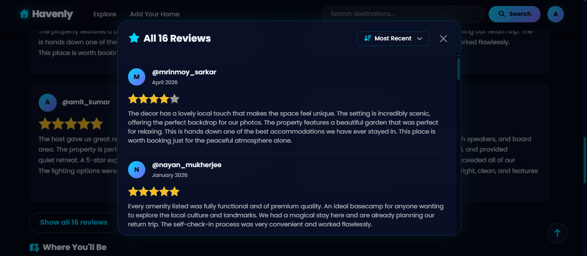
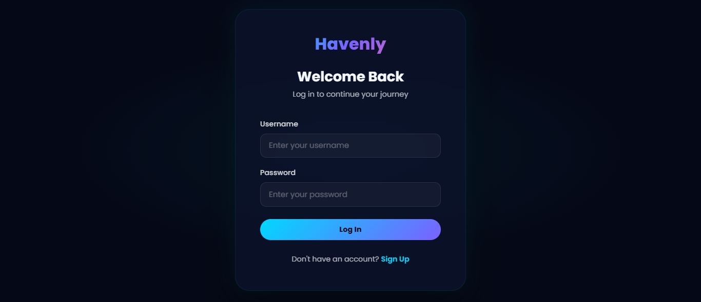
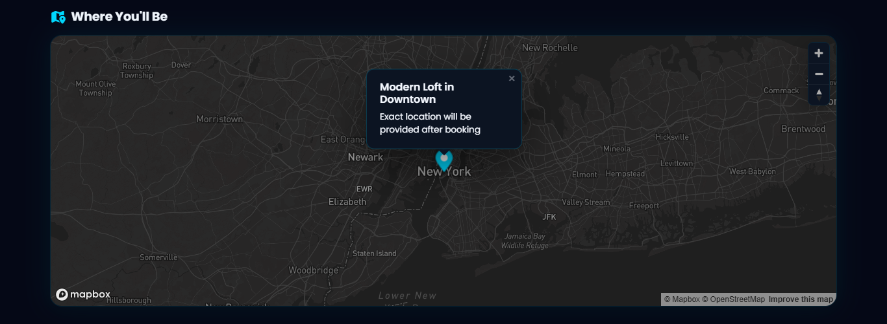
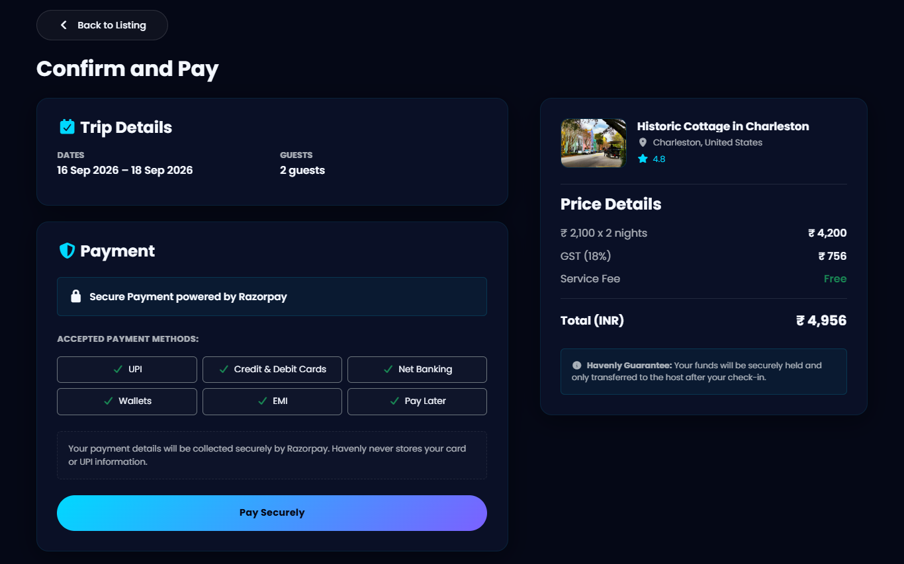

# 🏡 Havenly

## A Full-Stack Travel & Accommodation Booking Platform

**Havenly** is a modern full-stack travel and accommodation booking platform that provides an end-to-end experience for both travelers and property hosts — from discovering destinations and exploring properties to securely booking stays, managing reservations, and tracking hosting activity.

Travelers can search and explore properties, view detailed listings and interactive maps, select travel dates and guests, make secure payments through Razorpay, manage their bookings, cancel eligible reservations, receive booking confirmation emails, and download PDF booking receipts. Havenly also validates booking availability and prevents conflicting reservations for the same property.

Property hosts can create, edit, and manage listings, upload property images, manage reviews, and access a dedicated **Host Dashboard** that provides insights into total bookings, revenue, upcoming guests, completed stays, and recent reservations.

The platform integrates **Razorpay** for secure payment processing, **Nodemailer** for automated booking confirmation emails, **PDFKit** for dynamically generated booking receipts, **Cloudinary** for cloud-based image storage, and **Mapbox** for geocoding and interactive property maps.

Built with **Node.js, Express.js, MongoDB, Mongoose, EJS, and JavaScript**, Havenly follows a structured MVC architecture with secure authentication and authorization, server-side validation, session management, booking ownership protection, payment signature verification, error handling, and production-oriented security practices.

With its responsive dark glassmorphism interface and complete booking workflow, Havenly demonstrates the architecture and functionality of a real-world full-stack accommodation marketplace while remaining optimized as a portfolio-ready web application.

---

# 🌐 Live Demo

🔗 **Website:** https://havenly-avishek.onrender.com/listings

---

# 🎯 Key Features

- 🔐 Secure Authentication & Authorization (Passport.js)

- 🏡 Property Listing & Management

- 💳 Razorpay Payment Gateway Integration

- 📅 Complete Booking Management

- 📧 Booking Confirmation Emails

- 📄 Downloadable PDF Booking Receipts

- 👨‍💼 Host Dashboard & Reservation Analytics

- ⭐ Ratings & Reviews

- 🗺️ Interactive Mapbox Maps

- ☁️ Cloudinary Image Uploads

- 🔍 Smart Property Search

- 📱 Fully Responsive UI

- 🛡️ Production Security Hardening

- 🚀 RESTful MVC Architecture

---

# 📷 Screenshots

## 1. Home Page


## 2. Show Page


## 3. Create Listing


## 4. Edit Listing


## 5. Review Listing


## 6. Review Modal


## 7. Login Page


## 8. Signup Page


## 9. Map Location


## 10. Payment Page


## 11. My Bookings Page


## 12. Booking Details Page


## 13. Host Dashboard


---

# ✨ Features

## 🔐 Authentication & Security

- User Registration & Login
- Secure Authentication with Passport.js
- Session Management using Connect-Mongo
- Protected Routes & Authorization
- Flash Messages for User Feedback

## 🏡 Property Listings

- Create, Edit & Delete Listings
- View Detailed Property Information
- Property Owner Authorization
- Responsive Listing Cards
- Premium Show Page Layout

## 🔍 Search & Discovery

- Search Properties by Destination
- Modern Search Bar Interface
- Interactive Booking Widget
- Sticky Reservation Card

## 🖼️ Media Management

- Upload Property Images
- Cloudinary Cloud Storage Integration
- Optimized Image Delivery
- High-Quality Responsive Images

## 🗺️ Maps & Location Services

- Interactive Maps using Mapbox GL JS
- Automatic Location Geocoding
- Property Location Visualization

## ⭐ Reviews & Ratings

- Add & Delete Reviews
- Star Rating System
- Realistic Demo Review Seeder
- Review Modal with "Show All Reviews"

## 🛏️ Property Amenities

- Amenities Overview
- "Show All Amenities" Modal
- Premium Property Information Cards

## 💳 Booking Experience

- Booking Confirmation Email
- PDF Receipt Download
- Booking Details Page
- My Bookings Dashboard
- Booking Cancellation

## 💸 Payment Gateway Integration

- Secure Razorpay Payment Gateway
- Server-side Price Calculation
- GST Calculation
- Booking Availability Validation
- Overlapping Booking Prevention

## 👨‍💼 Host Dashboard

- Revenue Overview
- Upcoming Reservations
- Recent Reservations
- Booking Analytics
- Reservation Status Tracking

## 📄 Informational Pages

- About Us
- Help Center
- Safety Information
- Cancellation Policy
- Contact Us
- Careers
- Press
- Terms & Privacy

## 🛡️ Security

- Server-side Booking Validation
- Razorpay HMAC Signature Verification
- Secure Session Cookies
- Production Cookie Configuration
- NoSQL Query Sanitization
- Role-based Authorization
- Async Error Handling

## 💻 User Experience

- Fully Responsive Design
- Mobile-Friendly Interface
- Modern Glassmorphism UI
- Bootstrap 5 Components
- Interactive Animations
- Server-Side Validation
- Clean MVC Architecture

# 🚀 Future Enhancements

- Wishlist / Favorites
- Host Calendar
- Booking Notifications
- Admin Dashboard
- Multi-language Support
- Advanced Filters

---

# 🚀 Tech Stack

## 🖌️ Frontend

- HTML5
- CSS3
- Bootstrap
- EJS
- JavaScript

## ⚙️ Backend

- Node.js
- Express.js
- Passport.js
- Nodemailer
- PDFKit

## 🗄️ Database

- MongoDB Atlas
- Mongoose ODM

## 🔐 Authentication & Storage

- Passport.js
- Cloudinary
- Multer
- Connect-Mongo

## 🗺️ APIs & Integrations

- Mapbox Geocoding API
- Mapbox GL JS

## 💸 Payments

- Razorpay

---

# 📁 Project Highlights

✅ Full-Stack Travel & Accommodation Platform

✅ Secure Authentication & Authorization

✅ Complete CRUD Functionality

✅ Smart Property Search Experience

✅ Reviews, Ratings & Amenities Management

✅ Premium Property Detail Pages

✅ Razorpay Payment Integration

✅ Booking Management System

✅ Host Dashboard & Analytics

✅ Booking Confirmation Emails

✅ PDF Booking Receipts

✅ Cloudinary Image Upload & Storage

✅ Interactive Mapbox Maps & Geocoding

✅ Session Management with MongoDB

✅ Server-side Validation

✅ Production Security Hardening

✅ Responsive & Mobile-First Design

✅ Production Ready Deployment

✅ Modern Glassmorphism UI/UX

✅ RESTful MVC Architecture

---

# 🔑 Installation

```bash
git clone https://github.com/AvishekAmin/havenly.git

cd havenly

npm install

npm run dev
```

---

# 🛠️ Environment Variables

Create a `.env` file in the root directory:

```env
CLOUD_NAME=your_cloudinary_cloud_name
CLOUD_API_KEY=your_cloudinary_api_key
CLOUD_API_SECRET=your_cloudinary_api_secret

MAP_TOKEN=your_mapbox_access_token

ATLASDB_URL=your_mongodb_atlas_connection_string

SECRET=your_session_secret

RAZORPAY_KEY_ID=your_razorpay_key_id
RAZORPAY_KEY_SECRET=your_razorpay_key_secret

EMAIL_HOST=smtp.gmail.com
EMAIL_PORT=587
EMAIL_USER=your_email@gmail.com
EMAIL_PASS=your_app_specific_password
EMAIL_FROM="Havenly" <your_email@gmail.com>

APP_BASE_URL=http://localhost:8080
```

---

## 📁 Project Structure

```text
havenly/
│
├── constants/
│   └── categories.js
│
├── controllers/
│   ├── booking.js
│   ├── host.js
│   ├── listing.js
│   ├── review.js
│   └── user.js
│
├── init/
│   ├── data.js
│   ├── index.js
│   ├── seedCategories.js
│   └── seedReviews.js
│
├── models/
│   ├── booking.js
│   ├── listing.js
│   ├── review.js
│   └── user.js
│
├── public/
│   ├── css/
│   │   └── style.css
│   ├── images/
│   └── js/
│       ├── map.js
│       └── script.js
│
├── routes/
│   ├── booking.js
│   ├── host.js
│   ├── listing.js
│   ├── pages.js
│   ├── review.js
│   └── user.js
│
├── utils/
│   ├── bookingCalculator.js
│   ├── bookingSync.js
│   ├── emailService.js
│   ├── ExpressError.js
│   ├── receiptGenerator.js
│   └── wrapAsync.js
│
├── views/
│   ├── bookings/
│   │   ├── my-bookings.ejs
│   │   └── show.ejs
│   │
│   ├── host/
│   │   └── dashboard.ejs
│   │
│   ├── includes/
│   │   ├── flash.ejs
│   │   ├── footer.ejs
│   │   └── navbar.ejs
│   │
│   ├── layouts/
│   │   └── boilerplate.ejs
│   │
│   ├── listings/
│   │   ├── edit.ejs
│   │   ├── index.ejs
│   │   ├── new.ejs
│   │   ├── payment.ejs
│   │   └── show.ejs
│   │
│   ├── pages/
│   │   ├── about.ejs
│   │   ├── cancellation.ejs
│   │   ├── careers.ejs
│   │   ├── contact.ejs
│   │   ├── help.ejs
│   │   ├── press.ejs
│   │   ├── privacy.ejs
│   │   └── safety.ejs
│   │
│   ├── users/
│   │   ├── login.ejs
│   │   └── signup.ejs
│   │
│   └── error.ejs
│
├── screenshots/
│
├── .env.example
├── .gitignore
├── app.js
├── cloudConfig.js
├── middleware.js
├── package-lock.json
├── package.json
├── razorpay.js
├── README.md
└── schema.js
```

---

# 👨‍💻 Author

## Avishek Amin

🔗 **LinkedIn:** https://www.linkedin.com/in/avishekamin

🔗 **Email:** avishekamin207@gmail.com

🔗 **GitHub:** https://github.com/AvishekAmin

---

### ⭐ **If you like this project, consider giving it a star!**

---